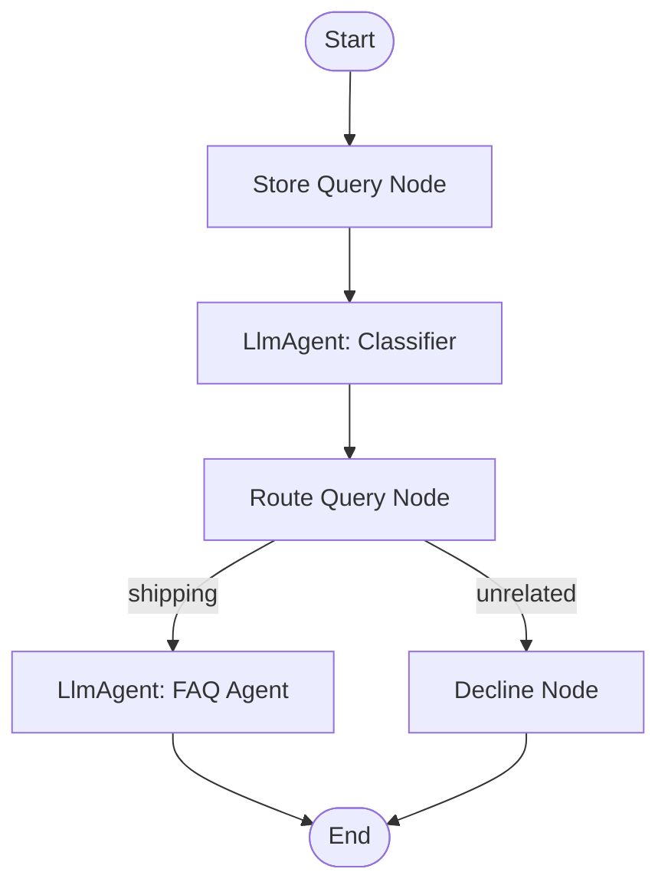

# 🚀 Intelligent Customer Support Agent


An automated customer support agent workflow powered by **Google Gemini 2.5 Flash** and built with the **Agent Development Kit (ADK)**. This agent classifies incoming queries, routes shipping-related questions to a playful and enthusiastic FAQ agent, and politely filters out unrelated queries.

---

## 🛠️ Tech Stack

- **Core Framework**: [Agent Development Kit (ADK)](https://github.com/google/agent-development-kit)
- **Large Language Model**: Google Gemini 2.5 Flash (via `google-genai` SDK)
- **Environment & Dependency Management**: [uv](https://docs.astral.sh/uv/) (Astral)
- **API Engine**: FastAPI & Uvicorn
- **Testing & Evals**: `pytest` & `agents-cli` evaluation framework

---

## 📐 Agent Workflow Architecture

The agent is designed as a graph-based workflow containing the following nodes:



1. **Store Query Node**: Stores the incoming user query in the workflow's context state.
2. **Classifier Agent**: Analyzes the query and classifies it as either shipping-related (`is_shipping_related: true`) or unrelated.
3. **Route Query Node**: Evaluates the classification outcome and directs the control flow.
4. **FAQ Agent**: An enthusiastic, emoji-loving support assistant that answers shipping-related queries and highlights key promotions (like our **FREE shipping on orders over $50** threshold).
5. **Decline Node**: Politely handles unrelated inquiries (e.g., weather or general knowledge) to keep the agent focused.

---

## 🚀 Getting Started

### 📋 Prerequisites

Ensure you have the following installed:
- **Python 3.11+**
- **uv** (Python package manager) - [Install Guide](https://docs.astral.sh/uv/getting-started/installation/)
- **agents-cli** - Install globally:
  ```bash
  uv tool install google-agents-cli
  ```

### ⚙️ Installation

Install all project dependencies (including development, evaluation, and linting tools):

```bash
uv sync --dev --extra eval --extra lint
```

Configure your environment variables by creating a `.env` file in the root directory:

```env
GEMINI_API_KEY=your_gemini_api_key_here
```

---

## 💻 Running the Agent

### 1. Launch the Local Development Playground

Start the local FastAPI playground server:

```bash
uv run adk web . --host 127.0.0.1 --port 8081 --reload_agents
```

Access the playground UI at: **[http://127.0.0.1:8081/dev-ui/?app=app](http://127.0.0.1:8081/dev-ui/?app=app)**

### 2. Querying the Agent via CLI

Run a single-turn query against the active local playground server:

```bash
agents-cli run --url http://127.0.0.1:8081 --mode adk --app-name app "How long does standard delivery take?"
```

---

## 📊 Evaluation and Testing

### Run Suite of Automated Tests

To execute unit and integration tests:

```bash
uv run pytest
```

### Run Evaluation Scenarios

Run agent evaluations locally using custom metrics like the agent turn count:

```bash
$env:GOOGLE_CLOUD_PROJECT="dummy-project"; agents-cli eval run --dataset tests/eval/datasets/basic-dataset.json --config tests/eval/eval_config.yaml --metrics agent_turn_count
```

Evaluation traces and graded results will be saved to the `./artifacts/` directory.

---

## 🌟 Sample Interaction

**User:** "How long does standard delivery take?"

**FAQ Agent:**
> OMG, hello there, superstar shipper! 👋 You've come to the *perfect* place for all your delivery deets! ✨
>
> You're wondering about our standard delivery times? That's a fantastic question! 🤩 While the exact timing can sometimes do a little happy dance depending on your destination and the specific item, our standard delivery usually takes about **3-7 business days** to zoom its way to your doorstep! 🚀💨
>
> For the most precise estimate, you can always pop your items into your cart and head to checkout – our super smart system will give you an exact delivery window right there! Or, you can check out our shipping calculator on our website with your zip code for a personalized projection! 🗺️💖
>
> And guess what?! While you're pondering delivery times, I have some *AMAZING* news to share! 🎉 We offer **ABSOLUTELY FREE SHIPPING** on all orders over $50! Yes, you heard that right – **FREE SHIPPING**! 💸🚚💨 How awesome is that?! It's our little way of saying THANK YOU for choosing us! 🎁
