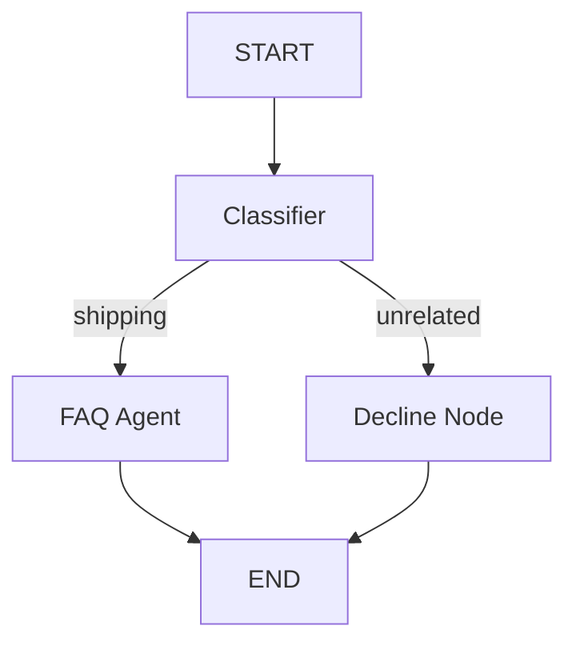

# Create Customer Support Agent Graph Workflow

We will create a new graph workflow agent project using ADK 2.0 named `customer-support-agent`. This agent will act as a customer support representative for a shipping company. It will classify queries, routing shipping-related ones to a shipping FAQ agent and unrelated ones to a polite decline node.

## User Review Required

> [!IMPORTANT]
> The project will be created in the current directory (`customer-support-agent`) as a prototype (`--prototype`) with no deployment files (`-d none`), as requested.

## Open Questions

None at this stage.

## Proposed Changes

### Project Scaffolding

We will initialize the project using:
```bash
agents-cli scaffold create customer-support-agent --agent adk --prototype -d none --output-dir ..
```

This will generate the standard ADK project files under the `customer-support-agent` workspace.

### Core Implementation

We will implement the graph workflow in `app/agent.py`. The graph will contain the following nodes:

1. **`START`**: Entry point.
2. **`classifier`**: A `FunctionNode` (or an `LlmAgent` + routing function) that determines if the user's query is shipping-related (rates, tracking, delivery, returns) or unrelated.
3. **`faq_agent`**: An `LlmAgent` acting as a shipping expert to answer FAQ questions.
4. **`decline_node`**: A node/function that politely declines to answer the query since it is unrelated to shipping.

#### Graph Structure


## Verification Plan

### Automated Verification
We will run:
- `agents-cli lint` to ensure code quality.
- `agents-cli run` to verify the routing behavior with sample inputs.

### Manual Verification
- We will run `agents-cli run "What are your shipping rates to Canada?"` and verify it routes to the FAQ agent and answers the question.
- We will run `agents-cli run "Who won the world cup in 2022?"` and verify it routes to the decline node and politely declines.
